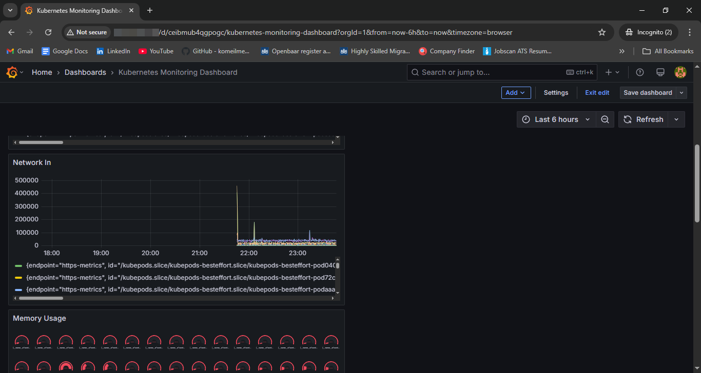

# 📊 GKE Monitoring Demo – Prometheus & Grafana

This project demonstrates how to set up a complete observability stack on **Google Kubernetes Engine (GKE)** using:

- [x] Prometheus for metrics collection  
- [x] Grafana for visualization  
- [x] kube-state-metrics for Kubernetes objects  
- [x] Node Exporter for node-level stats

---

## 📁 Project Structure

```
.
├── dashboards/
│   └── k8s-monitoring.json           # Exported Grafana dashboard
├── manifests/
│   ├── helm-values.yaml              # Helm config for Prometheus + Grafana
│   └── prometheus-lb.yaml            # Optional: Manual LoadBalancer service
└── README.md
```

---

## 🚀 How to Deploy

### 1. Create GKE Cluster (or any Kubernetes cluster)

```bash
gcloud container clusters create monitoring-demo \
  --num-nodes=3 \
  --region=us-central1 \
  --enable-ip-alias
```

### 2. Install Helm chart

```bash
helm repo add prometheus-community https://prometheus-community.github.io/helm-charts
helm repo update
helm install monitoring prometheus-community/kube-prometheus-stack \
  -f manifests/helm-values.yaml
```

### 3. Access Grafana

```bash
kubectl get svc -n default
```

Look for the `EXTERNAL-IP` of `monitoring-grafana`, then go to:

```
http://<EXTERNAL-IP>
```

Login credentials:

- Username: `admin`
- Password: `prom-operator`

---

## 📊 Grafana Dashboard

To import the dashboard manually:

1. Go to **Grafana UI → Dashboards → Import**
2. Upload file: `dashboards/k8s-monitoring.json`
3. Select Prometheus as your data source

---

## 📷 Preview



---

## ✅ What’s Included

This dashboard shows:

- CPU and Memory usage per container
- Pod status summary (Running, Pending, Failed)
- Container restart counts
- Network I/O
- Uptime of Pods

---

## 🙌 Credits

Built and tested by **Azin**, as part of a hands-on DevOps portfolio project.

---

## 📎 Notes

- If LoadBalancer doesn't work, you can manually expose Prometheus with:
  ```bash
  kubectl apply -f manifests/prometheus-lb.yaml
  ```
- Adjust `namespace` and `selectors` if you're deploying in a different context.

---
